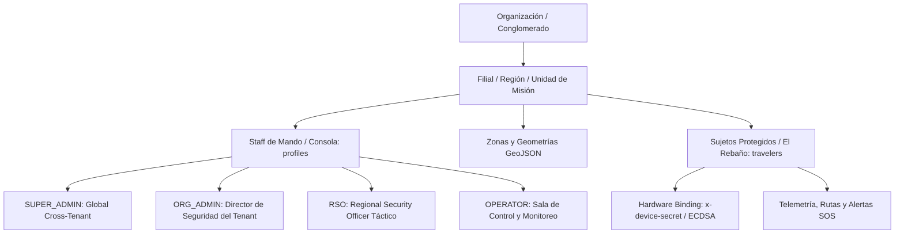

# MEMORIA TÉCNICA Y DE ARQUITECTURA — GZN (GREEN ZONE NETWORK)

> **PROYECTO SECURE ROUTE · SISTEMA DE PROTECCIÓN Y MOVILIDAD TÁCTICA**  
> *Documento de Memoria Viva, Gobernanza de Datos y Registro de Decisiones de Arquitectura (ADR)*  
> **Última actualización:** 2026-09-13 | **Versión:** 1.0 (Arranque de Backend)

---

## 1. Ficha Técnica y Ecosistema de Servicios

| Servicio | Identificador / URL | Función en GZN |
| :--- | :--- | :--- |
| **Repositorio Central** | [`https://github.com/Isskion/GZN`](https://github.com/Isskion/GZN) | Código fuente unificado (Backend, Web RSO, Scripts de infraestructura). |
| **Base de Datos & Geo** | **Supabase** (`hyhfdzribmathwridokg`)<br>API: `https://hyhfdzribmathwridokg.supabase.co` | **Fuente de la Verdad:** PostgreSQL + PostGIS nativo, RLS multi-tenant, Auth/SSO y Realtime WebSockets para el mapa en vivo. |
| **Alertas & Push** | **Firebase (FCM)** (`greenzonenavigator`) | **Canal de Emergencia:** Firebase Cloud Messaging (FCM via Firebase Admin SDK) para entrega instantánea de notificaciones push prioritarias y alertas críticas de misión hacia los RSOs. |
| **Alojamiento & Edge** | **Vercel** | Despliegue de la Consola Web RSO (Next.js App Router + MapLibre GL) y Serverless API Endpoints. |
| **Cartografía Base** | MapLibre GL + MapTiler / PMTiles | Capas vectoriales base sin telemetría de terceros ni fuga de privacidad. |

---

## 2. Propósito y Filosofía de Misión Crítica

GZN no es una aplicación convencional de navegación o mensajería; es un sistema de **salvaguarda de la integridad física y cumplimiento legal de *Duty of Care*** para personal corporativo, diplomático y convoyes en zonas de conflicto y alto riesgo (LATAM, África Occidental, Oriente Medio).

### Principios Fundamentales:
1. **La Red Fallará (Diseño Blackout):** Asumir que el 4G y las comunicaciones terrestres serán inhibidas o destruidas en el momento crítico. El sistema debe operar con geofencing local y canal de emergencia de bajo ancho de banda (SMS binario / satelital).
2. **Soberanía y Privacidad de Datos:** La telemetría de directivos y expatriados no puede pasar por intermediarios de rastreo publicitario (Google Maps / Apple MapKit).
3. **Escalada Antipánico y Fatiga de Alertas:** Los cortes de señal por sombra orográfica no son automáticamente un secuestro; la verificación escala progresivamente antes de movilizar al GSOC (Global Security Operations Center).
4. **Camuflaje OpSec Real:** Ante una inspección forzada en un retén armado, la app no debe parecer militar ni de seguridad; cuenta con interfaz neutra ("Field Notes") y PIN de coacción (*Duress PIN*).

---

## 3. Arquitectura del Backend y Flujos Operativos

### 3.1. Modelo Jerárquico Multi-tenant y Matriz de Roles (RBAC)



#### A. Correspondencia Formal de Roles (Hoja de Ruta v0.8 vs. DDL PostgreSQL)

| Rol Hoja de Ruta (v0.8) | Rol DDL (`profiles.role`) | Interfaz / Ámbito | Capacidades Tácticas y Operativas |
| :--- | :--- | :--- | :--- |
| **`GLOBAL_ADMIN`** | **`SUPER_ADMIN`** | Consola Web / Global | Administrador de plataforma. Bypasea filtro de organización en RLS (`get_auth_role() = 'SUPER_ADMIN'`). Gestión de tenants y auditoría global. |
| **`SECURITY_DIRECTOR`** | **`ORG_ADMIN`** | Consola Web / Tenant | Administrador corporativo. Gestión de perfiles de operadores (`INSERT/UPDATE` en `profiles`), consulta integral de `audit_logs` y configuración del tenant. |
| **`REGIONAL_RSO`** | **`RSO`** | Consola Web / Operativo | Oficial Regional de Seguridad. Creación y edición de perímetros y zonas de riesgo (`zones`), redacción de briefings y POIs (`briefings`), asignación y alta de viajeros (`travelers`), triaje y resolución de incidentes (`alerts`). |
| **`FIELD_OPERATOR_ESCORT`** | **`OPERATOR`** | Consola Web / Monitor | Operador de Sala de Control / Despacho / Escolta. Monitorización pasiva en tiempo real del mapa, telemetría y alertas. **Sin permisos** para crear o alterar zonas (`create_zone_with_geojson` devuelve HTTP 403) ni invitar/aprovisionar personal. |
| **`TRAVELER`** | **Entidad `travelers`** | Terminal Móvil / Terreno | **Personal protegido en campo ("El Rebaño").** No es un usuario de consola web. Emite telemetría (`POST /api/telemetry`) y SOS (`POST /api/alerts`) mediante enlace criptográfico de hardware. |

#### B. Separación Ontológica: Personal de Consola (`profiles`) vs. Terreno (`travelers`)

La tabla `public.profiles` está vinculada mediante clave foránea 1:1 a `auth.users(id)` (`REFERENCES auth.users(id) ON DELETE CASCADE`). Los usuarios de `profiles` son personas humanas que inician sesión interactiva en la consola web con credenciales Supabase Auth (cookies / JWT).

Por el contrario, la entidad **`TRAVELER` reside exclusivamente en `public.travelers`** y no posee cuenta en `profiles` por cuatro razones de misión crítica:
1. **Contención de Superficie de Ataque:** Evita que un viajero pueda iniciar sesión en la URL de la consola de mando web o acceder a la cartografía táctica general de otros operativos.
2. **Privacidad y OpSec:** Las políticas RLS de `profiles` permiten visibilidad interna entre miembros del tenant. Aislar a los viajeros en `public.travelers` impide que un dispositivo capturado en campo pueda enumerar al resto de viajeros o conocer sus trayectorias.
3. **Flujo de Aprovisionamiento Estricto:** Cumple la regla de la Hoja de Ruta: *"Alta por invitación y aprovisionamiento gestionado por el RSO; prohibido el autorregistro público"*. El RSO crea la fila en `travelers` y vincula el hardware mediante aprovisionamiento directo (`device_secret_hash`).
4. **Eficiencia en Redes Hostiles:** Los terminales móviles emiten pings de telemetría a alta frecuencia (hasta 1 Hz) sobre redes 2G o satelitales. Utilizan una autenticación compacta de hardware (`x-device-secret` / firma ECDSA P-256) sin sobrecarga de tokens web interactivos.

---

### 3.2. Catálogo y Clasificación de Zonas (Geofencing)

Las zonas se almacenan en Supabase utilizando geometrías espaciales PostGIS (`geometry(Polygon, 4326)` o `MultiPolygon`):

| Tipo de Zona | Severidad | Comportamiento en Ruteo | Acción al Entrar / Violar |
| :--- | :--- | :--- | :--- |
| **Zona Roja (`RED`)** | Conflicto Activo / Peligro Letal | **Bloqueante.** Prohibido transitar salvo escape. | Alerta inmediata al RSO y vibración persistente al móvil. |
| **Zona Ámbar (`AMBER`)** | Riesgo Medio / Toque de Queda | Penalizada (solo si no hay alternativa viable). | Aviso informativo al viajero y aumento de telemetría a 1 Hz. |
| **Safe Haven (`SAFE_HAVEN`)** | Refugio, Embajada, Base Segura | Prioritaria en replanificación de escape. | Marca de seguridad, parada de emergencia y check-in automático. |
| **Corredor Seguro (`CORRIDOR`)** | Ruta previamente autorizada | Preferente. | Monitoreo de abandono de ruta. |

---

### 3.3. Gestión de Briefings con POIs Compartidos

El RSO prepara un desplazamiento generando un **Briefing de Misión**:
1. El RSO abre el mapa, dibuja los puntos de interés (POIs: punto de encuentro, hospital concertado, refugio, zonas vedadas).
2. Asigna el briefing a uno o varios miembros del "rebaño" o al convoy completo.
3. El móvil descarga los POIs y las zonas de forma local para visualizarlos sin necesidad de conexión.
4. Al cruzar el viajero el perímetro del país o región, recibe un **Mensaje de Bienvenida Táctico** con los números de emergencia del RSO local y las pautas activas de seguridad.

---

### 3.4. Protocolo de "Hombre Muerto" (Dead Man's Switch)

Si un viajero entra en una zona de riesgo o ruta crítica y el backend deja de recibir telemetría:
1. **Fase 1 (Aviso Local - 60 seg):** La app vibra y solicita confirmación con PIN o botón ("Confirme su estado").
2. **Fase 2 (Ping por Canal Secundario):** Intento de comprobación vía SMS binario o enlace alternativo.
3. **Fase 3 (Ventana Dinámica por Vector de Salida):** Si la última velocidad y rumbo indicaban que el convoy ya salía de la zona, se concede una ventana de gracia para evitar falsas alarmas por sombra orográfica.
4. **Fase 4 (Escalada a Crisis GSOC):** Si no hay respuesta tras la ventana de gracia, se dispara alerta roja al RSO con la última posición conocida, nivel de batería y vector de desplazamiento.

---

## 4. Esquema de Base de Datos DDL (PostgreSQL + PostGIS)

Este esquema se despliega en el proyecto Supabase `hyhfdzribmathwridokg`. Incluye soporte geoespacial nativo, índices espaciales R-Tree (`GIST`) y funciones RPC de cálculo ultra-rápido de violaciones de perímetro.

```sql
-- ============================================================================
-- GZN POSTGIS SCHEMA v1.0 — PROYECTO SECURE ROUTE
-- ============================================================================

-- 1. Habilitar extensión geoespacial
CREATE EXTENSION IF NOT EXISTS postgis;
CREATE EXTENSION IF NOT EXISTS "uuid-ossp";

-- 2. Organizaciones (Multi-tenancy)
CREATE TABLE IF NOT EXISTS public.organizations (
    id UUID PRIMARY KEY DEFAULT uuid_generate_v4(),
    name TEXT NOT NULL,
    cif_tax_id TEXT,
    created_at TIMESTAMPTZ DEFAULT NOW(),
    updated_at TIMESTAMPTZ DEFAULT NOW()
);

-- 3. Perfiles de Usuario (RSOs, Operadores de Seguridad, Administradores)
CREATE TABLE IF NOT EXISTS public.profiles (
    id UUID PRIMARY KEY REFERENCES auth.users(id) ON DELETE CASCADE,
    organization_id UUID NOT NULL REFERENCES public.organizations(id),
    full_name TEXT NOT NULL,
    role TEXT NOT NULL CHECK (role IN ('SUPER_ADMIN', 'ORG_ADMIN', 'RSO', 'OPERATOR')),
    phone TEXT,
    emergency_contact TEXT,
    is_active BOOLEAN DEFAULT TRUE,
    created_at TIMESTAMPTZ DEFAULT NOW(),
    updated_at TIMESTAMPTZ DEFAULT NOW()
);

-- 4. El Rebaño: Viajeros, Expatriados y Conductores asignados
CREATE TABLE IF NOT EXISTS public.travelers (
    id UUID PRIMARY KEY DEFAULT uuid_generate_v4(),
    organization_id UUID NOT NULL REFERENCES public.organizations(id),
    assigned_rso_id UUID REFERENCES public.profiles(id),
    user_id UUID REFERENCES auth.users(id) ON DELETE SET NULL, -- Enlace opcional a identidad humana Supabase Auth
    full_name TEXT NOT NULL,
    email TEXT,
    phone TEXT NOT NULL,
    callsign TEXT, -- Indicativo de radio o convoy
    status TEXT NOT NULL DEFAULT 'SAFE' CHECK (status IN ('SAFE', 'WARNING', 'DANGER', 'PANIC', 'INCOMMUNICADO')),
    last_latitude DOUBLE PRECISION,
    last_longitude DOUBLE PRECISION,
    last_ping_at TIMESTAMPTZ,
    battery_level INT,
    device_secret_hash TEXT, -- Hash SHA-256 de secreto de hardware (escalón intermedio hacia ECDSA P-256)
    created_at TIMESTAMPTZ DEFAULT NOW(),
    updated_at TIMESTAMPTZ DEFAULT NOW()
);

-- 5. Catálogo de Zonas de Riesgo y Refugios (GeoJSON / PostGIS)
CREATE TABLE IF NOT EXISTS public.zones (
    id UUID PRIMARY KEY DEFAULT uuid_generate_v4(),
    organization_id UUID NOT NULL REFERENCES public.organizations(id),
    created_by UUID REFERENCES public.profiles(id),
    name TEXT NOT NULL,
    description TEXT,
    severity TEXT NOT NULL CHECK (severity IN ('RED', 'AMBER', 'SAFE_HAVEN', 'CORRIDOR')),
    color_hex TEXT DEFAULT '#EF4444',
    geom GEOMETRY(Polygon, 4326) NOT NULL,
    buffer_meters INT DEFAULT 0 CHECK (buffer_meters >= 0),
    is_curfew BOOLEAN DEFAULT FALSE,
    curfew_start TIME WITHOUT TIME ZONE,
    curfew_end TIME WITHOUT TIME ZONE,
    contact_phone TEXT,
    radio_frequency TEXT,
    gate_access_protocol TEXT,
    valid_from TIMESTAMPTZ DEFAULT NOW(),
    valid_until TIMESTAMPTZ,
    is_active BOOLEAN DEFAULT TRUE,
    created_at TIMESTAMPTZ DEFAULT NOW(),
    updated_at TIMESTAMPTZ DEFAULT NOW(),
    CONSTRAINT check_curfew_consistency CHECK (is_curfew = FALSE OR (curfew_start IS NOT NULL AND curfew_end IS NOT NULL))
);

-- Índice espacial para consultas en milisegundos
CREATE INDEX IF NOT EXISTS idx_zones_geom ON public.zones USING GIST (geom);
CREATE INDEX IF NOT EXISTS idx_zones_org_active ON public.zones(organization_id, is_active);
CREATE INDEX IF NOT EXISTS idx_zones_curfew ON public.zones(organization_id, is_curfew) WHERE is_active = TRUE;

-- 6. Briefings y Puntos de Interés (POIs)
CREATE TABLE IF NOT EXISTS public.briefings (
    id UUID PRIMARY KEY DEFAULT uuid_generate_v4(),
    organization_id UUID NOT NULL REFERENCES public.organizations(id),
    author_rso_id UUID NOT NULL REFERENCES public.profiles(id),
    title TEXT NOT NULL,
    welcome_message TEXT,
    protocol_instructions TEXT,
    created_at TIMESTAMPTZ DEFAULT NOW(),
    updated_at TIMESTAMPTZ DEFAULT NOW()
);

CREATE TABLE IF NOT EXISTS public.briefing_pois (
    id UUID PRIMARY KEY DEFAULT uuid_generate_v4(),
    briefing_id UUID NOT NULL REFERENCES public.briefings(id) ON DELETE CASCADE,
    name TEXT NOT NULL,
    category TEXT NOT NULL CHECK (category IN ('EXTRACTION_POINT', 'HOSPITAL', 'POLICE', 'SAFE_HOUSE', 'CHECKPOINT', 'DANGER_POINT')),
    latitude DOUBLE PRECISION NOT NULL,
    longitude DOUBLE PRECISION NOT NULL,
    notes TEXT
);

-- 7. Alertas de Seguridad y Eventos de Pánico
CREATE TABLE IF NOT EXISTS public.alerts (
    id UUID PRIMARY KEY DEFAULT uuid_generate_v4(),
    organization_id UUID NOT NULL REFERENCES public.organizations(id),
    traveler_id UUID NOT NULL REFERENCES public.travelers(id) ON DELETE CASCADE,
    zone_id UUID REFERENCES public.zones(id),
    alert_type TEXT NOT NULL CHECK (alert_type IN ('ZONE_VIOLATION', 'PANIC_BUTTON', 'DEAD_MAN_TRIGGER', 'DURESS_PIN', 'DEVIATION', 'MANUAL_SOS')),
    severity TEXT NOT NULL CHECK (severity IN ('LOW', 'MEDIUM', 'HIGH', 'CRITICAL')),
    latitude DOUBLE PRECISION NOT NULL,
    longitude DOUBLE PRECISION NOT NULL,
    memo TEXT,
    status TEXT NOT NULL DEFAULT 'OPEN' CHECK (status IN ('OPEN', 'ACKNOWLEDGED', 'INVESTIGATING', 'RESOLVED', 'FALSE_ALARM')),
    resolved_by UUID REFERENCES public.profiles(id),
    resolved_at TIMESTAMPTZ,
    created_at TIMESTAMPTZ DEFAULT NOW()
);

-- 8. Registro de Auditoría Inmutable (Legal & Duty of Care)
CREATE TABLE IF NOT EXISTS public.audit_logs (
    id UUID PRIMARY KEY DEFAULT uuid_generate_v4(),
    organization_id UUID NOT NULL REFERENCES public.organizations(id),
    performed_by UUID,
    action TEXT NOT NULL,
    entity_type TEXT NOT NULL,
    entity_id TEXT,
    payload JSONB,
    created_at TIMESTAMPTZ DEFAULT NOW()
);

-- ============================================================================
-- FUNCIONES RPC GEOESPACIALES
-- ============================================================================

-- Comprueba si una coordenada está dentro de alguna zona activa o buffer y evalúa toques de queda
CREATE OR REPLACE FUNCTION public.check_point_zones(
    p_org_id UUID,
    p_lat DOUBLE PRECISION,
    p_lon DOUBLE PRECISION
)
RETURNS TABLE (
    zone_id UUID,
    zone_name TEXT,
    severity TEXT,
    color_hex TEXT,
    buffer_meters INT,
    is_in_buffer BOOLEAN,
    is_curfew BOOLEAN,
    curfew_active_now BOOLEAN
)
LANGUAGE plpgsql
STABLE
AS $$
... (ver sql/004_zones_enhancements.sql para implementación completa con CURRENT_TIME)
$$;

-- Encuentra el Safe Haven más cercano con metadatos tácticos de contacto y acceso
CREATE OR REPLACE FUNCTION public.find_nearest_safe_haven(
    p_org_id UUID,
    p_lat DOUBLE PRECISION,
    p_lon DOUBLE PRECISION
)
RETURNS TABLE (
    zone_id UUID,
    zone_name TEXT,
    description TEXT,
    contact_phone TEXT,
    radio_frequency TEXT,
    gate_access_protocol TEXT,
    distance_meters DOUBLE PRECISION
)
LANGUAGE sql
STABLE
AS $$
    SELECT 
        z.id AS zone_id,
        z.name AS zone_name,
        z.description,
        z.contact_phone,
        z.radio_frequency,
        z.gate_access_protocol,
        ST_Distance(
            z.geom::geography, 
            ST_SetSRID(ST_Point(p_lon, p_lat), 4326)::geography
        ) AS distance_meters
    FROM public.zones z
    WHERE z.organization_id = p_org_id
      AND z.severity = 'SAFE_HAVEN'
      AND z.is_active = TRUE
    ORDER BY distance_meters ASC
    LIMIT 1;
$$;

-- Creación segura de zona con geometría GeoJSON, buffers, toques de queda y metadatos safe haven
CREATE OR REPLACE FUNCTION public.create_zone_with_geojson(
    p_org_id UUID DEFAULT NULL,
    p_name TEXT DEFAULT NULL,
    p_description TEXT DEFAULT NULL,
    p_severity TEXT DEFAULT NULL,
    p_color_hex TEXT DEFAULT NULL,
    p_geojson TEXT DEFAULT NULL,
    p_valid_until TIMESTAMPTZ DEFAULT NULL,
    p_buffer_meters INT DEFAULT 0,
    p_is_curfew BOOLEAN DEFAULT FALSE,
    p_curfew_start TIME WITHOUT TIME ZONE DEFAULT NULL,
    p_curfew_end TIME WITHOUT TIME ZONE DEFAULT NULL,
    p_contact_phone TEXT DEFAULT NULL,
    p_radio_frequency TEXT DEFAULT NULL,
    p_gate_access_protocol TEXT DEFAULT NULL
)
RETURNS public.zones
LANGUAGE plpgsql
SECURITY DEFINER
SET search_path = public, extensions
AS $$
... (ver sql/004_zones_enhancements.sql para implementación completa y control de rol)
$$;
```

---

## 5. Arquitectura de Almacén Único (PostgreSQL + PostGIS) y Despacho Push (Firebase FCM)

En concordancia con el Punto 6 de la auditoría y la evolución real de la plataforma, se descarta el almacenamiento intermedio en colecciones no implementadas de Firestore (`active_telemetry`, `broadcast_alerts`, `sos_channel`).

### 5.1. PostgreSQL + PostGIS como Fuente Única de la Verdad
Toda la persistencia de datos de GZN se consolida en Supabase (PostgreSQL 15 + PostGIS):
*   **Telemetría y Posicionamiento:** Los pings de telemetría de terminales móviles (`POST /api/telemetry`) actualizan directamente `public.travelers` (`last_latitude`, `last_longitude`, `battery_level`, `status`, `last_ping_at`) e insertan eventos forenses en `public.audit_logs`.
*   **Motor Geoespacial en Servidor:** Las funciones RPC (`check_point_zones`, `find_nearest_safe_haven`, `create_zone_with_geojson`) ejecutan la evaluación de geofencing y cálculo métrico en milisegundos directamente sobre índices espaciales `GIST`.
*   **Ciclo de Vida de Alertas:** Las incidencias y pánicos se gestionan en `public.alerts`, controladas por RLS multi-tenant.

### 5.2. Firebase Cloud Messaging (FCM): Pasarela Exclusiva de Notificaciones Push
Firebase se reserva exclusivamente para el despacho de mensajería push de alta prioridad mediante `firebase-admin/messaging` (`src/lib/firebase/admin.ts`):
*   **Canales Tópicos por Organización:** Los RSOs y operadores suscritos al tópico `org_{orgId}_alerts` reciben notificaciones en tiempo real ante eventos críticos.
*   **Disparadores Activos:**
    1. Violación de Zona Roja (`ZONE_VIOLATION` detectada en telemetría).
    2. Botón de Pánico SOS accionado por un viajero en campo (`PANIC_BUTTON`).
    3. SOS manual despachado por un operador RSO (`MANUAL_SOS`).
*   **Configuración de Prioridad:** Envíos con `priority: 'high'` y flag `contentAvailable: true` para notificación inmediata en dispositivos móviles.

---

## 6. Sistema de Hooks y Cumplimiento de la Memoria

Para garantizar que **NADA** se desarrolle al margen de esta memoria, se han configurado dos barreras automáticas:

1. **Lifecycle Hook de Antigravity (`.agents/hooks.json`):**
   *   Intercepta cada invocación (`PreInvocation`) e inyecta la regla fundamental de actualización documental mediante `./scripts/memory-hook.sh`.
2. **Git Pre-Commit Hook (`.githooks/pre-commit`):**
   *   Comprueba la integridad y presencia de `MEMORIA.md` antes de permitir cualquier commit en el repositorio.
3. **Reglamento Operativo (`AGENTS.md` y `GEMINI.md`):**
   *   Contrato de pair-programming explícito: ningún cambio de código, tabla SQL o endpoint se considera finalizado sin registrarse en esta memoria.

---

## 7. Registro de Decisiones de Arquitectura (ADR)

*   **ADR-001 (2026-09-13 / Actualizado 2026-09-15): Arquitectura de Almacén Único (PostgreSQL + PostGIS) y Despacho Push con Firebase FCM.**  
    *Decisión:* Corrección y sinceramiento tras la auditoría (Punto 6). Se descarta el almacenamiento efímero en colecciones no implementadas de Firestore (`active_telemetry`, `broadcast_alerts`, `sos_channel`) para evitar duplicidad de fuentes y complejidad innecesaria. Supabase (PostgreSQL + PostGIS) asume la totalidad de la persistencia transaccional, la telemetría en tiempo real, el geofencing espacial de alta velocidad y la auditoría inmutable. Firebase se reserva exclusivamente como pasarela de notificaciones push prioritarias mediante FCM (`firebase-admin`).
*   **ADR-002 (2026-09-13): Ruteo Dual Online/Offline.**  
    *Decisión:* El ruteo no puede depender exclusivamente de APIs cloud. La app móvil incluirá un motor embebido (GraphHopper/Valhalla) con el grafo vial y zonas precargadas para navegación sin red.
*   **ADR-003 (2026-09-13): Descarte del Modo Oculto Puro / Adopción de Silent Duress.**  
    *Decisión:* No se violan las políticas de Google Play / Apple Store. Se implementa interfaz señuelo ("Field Notes") y Duress PIN para protección en inspección física.
*   **ADR-004 (2026-09-13): Row Level Security (RLS) Estricto con Funciones SECURITY DEFINER.**  
    *Decisión:* RLS activo en el 100% de las tablas. Se implementan funciones auxiliares `get_auth_org_id()` y `get_auth_role()` con `SECURITY DEFINER` para evaluar pertenencia a organización y rol sin incurrir en recursión infinita en PostgreSQL. Se garantiza inmutabilidad absoluta de `audit_logs` (sin UPDATE ni DELETE).
*   **ADR-005 (2026-09-13): Next.js 15 App Router + MapLibre GL para Consola RSO y Edge APIs.**  
    *Decisión:* La consola de mando del RSO se implementa con Next.js 15 (App Router), Tailwind CSS y MapLibre GL para visualización cartográfica táctica y soporte de capas GeoJSON vectoriales sin depender de SDKs cerrados. Las rutas API (`/api/zones`, `/api/telemetry`, `/api/alerts`) orquestan la evaluación espacial en PostGIS y el despacho de notificaciones de emergencia con Firebase Admin SDK (FCM).
*   **ADR-006 (2026-09-14): Autenticación Dual RSO/Dispositivo, Tenancy Estricto y RPC PostGIS GeoJSON.**  
    *Decisión:* Resolución de los Bloqueantes 1 y 2 de la auditoría:
    1. **Autenticación Consola RSO:** `/api/zones` (GET/POST) y `/api/alerts` (GET) sustituyen el cliente `createAdminClient` por el cliente de sesión `createClient` respetando RLS. Se elimina el parámetro `organization_id` del query/body; la pertenencia se deriva estrictamente de `public.get_auth_org_id()` vía Postgres.
    2. **Autenticación Terminal Móvil (Escalón Intermedio):** `/api/telemetry` y `/api/alerts` (SOS móvil) exigen la cabecera `x-device-secret`, validada contra `travelers.device_secret_hash` (SHA-256 en tiempo constante). Se documenta expresamente como paso intermedio previo al binding criptográfico asimétrico ECDSA P-256 definitivo (Hoja de Ruta Subsistema 1). Ningún endpoint en `src/app/api/` usa `createAdminClient` directamente.
    3. **Creación de Zonas e Integridad Geoespacial:** Despliegue de `sql/003_zone_creation_rpc.sql` con la función RPC `create_zone_with_geojson` (usa `ST_GeomFromGeoJSON`, `ST_SetSRID` en 4326 y `ST_IsValid`). Se elimina el fallback de inserción directa silenciosa en el route handler y se implementa validador estricto en servidor (`validateGeoJSONPolygon`) para devolver 400 controlado ante geometrías malformadas o anillos no cerrados. Se añade control estricto de roles en la RPC (`public.get_auth_role() IN ('RSO', 'ORG_ADMIN', 'SUPER_ADMIN')`) para impedir que operadores (`OPERATOR`) escalen privilegios creando zonas dentro del mismo tenant (error HTTP 403).  
    *Nota de Gobernanza y Auditoría (2026-09-14):* La validación inicial con ramas mock de desarrollo en `session.ts` fue rechazada formalmente por la auditoría por no ser representativa del sistema real y suponer un patrón inseguro. Se eliminó cualquier mecanismo de bypass o sesión simulada en `src/lib/auth/session.ts`. Toda validación descansa exclusivamente en `public.get_auth_role()` en PostgreSQL y `supabase.auth.getUser()` real.

*   **ADR-007 (2026-09-15): Modelo de Identidades Dual: Separación entre Staff de Consola (profiles) y Sujetos de Protección en Terreno (travelers).**  
    *Decisión:* Resolución del Punto 3 de la auditoría (Claude):
    1. **Mapeo Formal de Roles:** Se formaliza la correspondencia 1:1 entre los roles de la Hoja de Ruta v0.8 y el DDL: `GLOBAL_ADMIN` -> `SUPER_ADMIN`, `SECURITY_DIRECTOR` -> `ORG_ADMIN`, `REGIONAL_RSO` -> `RSO`, `FIELD_OPERATOR_ESCORT` -> `OPERATOR`.
    2. **Separación Ontológica:** `public.profiles` está vinculado a `auth.users(id)` y restringido exclusivamente a roles de staff con acceso a la consola de mando web. Los viajeros residen en `public.travelers` como sujetos protegidos en campo, sin cuenta interactiva de consola. Se autentican mediante enlace de hardware (`x-device-secret` / ECDSA P-256), preservando el principio de mínimo privilegio, la contención de superficie de ataque y el secreto de las rutas entre compañeros de organización.
    3. **Hoja de Ruta hacia App Móvil:** Para futuras versiones de la app con interfaz de usuario personalizada (briefings y POIs individuales), se habilitará la relación opcional `travelers.user_id REFERENCES auth.users(id)` con salvaguardas RLS que impidan el acceso a la consola de mando.

*   **ADR-008 (2026-09-15): Enriquecimiento de Zonas: Buffers Espaciales, Toques de Queda y Metadatos Tácticos de Refugios (Safe Havens).**  
    *Decisión:* Resolución del Punto 4 de la auditoría (Claude / Hoja de Ruta v0.8):
    1. **Buffers de Amortiguamiento (`buffer_meters`):** Se introduce la distancia de pre-alerta en metros para advertir de proximidad a áreas de riesgo antes de consumar la incursión en la zona vedada. `check_point_zones` evalúa `ST_DWithin` en geography y devuelve `is_in_buffer`.
    2. **Toques de Queda (`is_curfew`, `curfew_start`, `curfew_end`):** Soporte de ventanas horarias restrictivas (incluyendo cruce de medianoche, ej. 22:00 a 06:00) con evaluación automática en `check_point_zones` (`curfew_active_now`).
    3. **Metadatos Tácticos de Refugios (`contact_phone`, `radio_frequency`, `gate_access_protocol`):** Enriquecimiento de zonas `SAFE_HAVEN` para que la función RPC `find_nearest_safe_haven` provea inmediatamente teléfono de enlace, frecuencia de radio en MHz y protocolo de acceso al puesto de guardia cuando un convoy solicite escape de emergencia.
    4. **Actualización Integral de RPCs y API:** Implementación en `sql/004_zones_enhancements.sql`, validador TypeScript en servidor (`validateZoneEnhancements`) y adaptación completa de `GET/POST /api/zones`.

*   **ADR-009 (2026-09-15): Trazabilidad Inmutable DPIA: Registro Forense de Eventos de Seguridad en audit_logs.**  
    *Decisión:* Resolución del Punto 5 de la auditoría (Claude / RGPD Art. 35 / Duty of Care):
    1. **Servicio Centralizado (`src/lib/audit/logger.ts`):** Módulo `logAuditEvent` con tipos estrictos para acciones (`ZONE_CREATED`, `ALERT_TRIGGERED`, `ZONE_VIOLATION_DETECTED`, `ALERT_RESOLVED`) y entidades (`ZONE`, `ALERT`, `TRAVELER`). Principio *fail-safe* para no bloquear el despacho de emergencias en caso de incidencia transitoria en logs.
    2. **Trazabilidad en Creación de Zonas (`POST /api/zones`):** Se registra `ZONE_CREATED` con el `performed_by` del usuario RSO autenticado y payload con la configuración perimetral completa.
    3. **Trazabilidad en Alertas SOS (`POST /api/alerts`):** Se registra `ALERT_TRIGGERED` diferenciando el origen: `performed_by = user.id` para SOS manual desde la consola RSO (`trigger_source: 'RSO_CONSOLE'`), o `performed_by = null` con `traveler_id` y `trigger_source: 'DEVICE_HARDWARE'` para disparos desde terminales móviles.
    4. **Trazabilidad en Incursiones Espaciales (`POST /api/telemetry`):** Se registra `ZONE_VIOLATION_DETECTED` automáticamente cuando PostGIS detecta penetración en zona roja, archivando coordenadas, velocidad satelital y nivel de batería.
    5. **Inmutabilidad y Garantías Forenses:** Garantizada a nivel de aplicación frente a usuarios autenticados mediante las políticas RLS de `audit_logs` (solo `INSERT` y `SELECT`; sin `UPDATE` ni `DELETE` para usuarios finales, operadores o RSO). Se reconoce la distinción técnica inherente a PostgreSQL/Supabase donde la clave de infraestructura `service_role` tiene capacidad de bypass de RLS para tareas de mantenimiento y migraciones internas.

*   **ADR-010 (2026-09-15): Gestión del Ciclo de Vida de Alertas: Resolución Forense y Lógica Preventiva Multi-Incidente.**  
    *Decisión:* Implementación del Paquete B1 del Core Backend GZN:
    1. **Rutas RESTful Dinámicas (`/api/alerts/[id]`):** Se implementan `GET` (detalle forense individual con joins a viajero, zona y perfil de resolución) y `PATCH` (transiciones de estado y enriquecimiento táctico de observaciones en `memo`).
    2. **Control de Acceso y RBAC:** Autenticación estricta por sesión web (`getAuthenticatedSession`). Conforme a la matriz aprobada en ADR-007 y RLS vigente (`sql/002_rls_security_policies.sql`), se habilita a los operadores de sala (`OPERATOR`) para la gestión, triaje y cierre operativo de alertas (`ACKNOWLEDGED`, `INVESTIGATING`, `RESOLVED`, `FALSE_ALARM`).
    3. **Firma Forense de Cierre:** En transiciones a `RESOLVED` y `FALSE_ALARM`, se estampa automáticamente `resolved_by = auth.uid()` y `resolved_at = NOW()`. En caso de reapertura operativa a `OPEN`, se resetean ambos campos a `NULL`.
    4. **Lógica Preventiva Multi-Incidente (Mandato Auditoría Claude):** Al resolver o marcar como falsa alarma una alerta (`reset_traveler_status: true`), el sistema consulta obligatoriamente si el mismo viajero (`traveler_id`) mantiene OTRAS alertas activas (`OPEN`, `ACKNOWLEDGED`, `INVESTIGATING`). Si persisten otros incidentes, el estado del viajero en `public.travelers` permanece intacto (ej. `PANIC` o `DANGER`). Solo cuando la totalidad de alertas abiertas ha sido mitigada, el estado del viajero se normaliza a `SAFE`.
    5. **Trazabilidad Forense Ampliada (ADR-009):** Se añade `ALERT_STATUS_CHANGED` al catálogo de `AuditAction` para registrar transiciones intermedias o reaperturas, complementando a `ALERT_ACKNOWLEDGED` y `ALERT_RESOLVED` con payload auditado que incluye `traveler_status_reset` y `reset_reason`.
    6. **Ampliación de Listado (`GET /api/alerts`):** Soporte de filtros por `status`, `severity`, `traveler_id` y paginación (`limit`, `offset`) con join a `profiles:resolved_by`.

*   **ADR-011 (2026-09-15): Gestión Completa de Zonas Tácticas: Mantenimiento, Soft-Delete y Salvaguarda Forense en DELETE.**  
    *Decisión:* Implementación del Paquete B2 del Core Backend GZN:
    1. **Rutas RESTful Dinámicas (`/api/zones/[id]`):** Se implementan `GET` (detalle y geometría GeoJSON Feature), `PATCH` (modificación parcial de propiedades tácticas, buffers, curfews, safe havens y geometría opcional) y `DELETE` (desactivación o retirada controlada).
    2. **Control de Acceso Estricto con Validación de Perfil Activo (Mandato Claude):** Tanto en `PATCH` como en `DELETE`, se verifica explícitamente en TypeScript que el perfil del usuario autenticado en `public.profiles` posea rol autorizado (`RSO`, `ORG_ADMIN`, `SUPER_ADMIN`) y que su flag `is_active` sea `TRUE` (`.eq('is_active', true)`). Los operadores (`OPERATOR`) reciben un rechazo controlado `HTTP 403 Forbidden` defensivo, alineado con las políticas RLS de PostgreSQL.
    3. **Soft-Delete Táctico por Defecto en `DELETE`:** Debido a la restricción de integridad referencial donde `public.alerts.zone_id REFERENCES public.zones(id)` no dispone de borrado en cascada, y para preservar la cadena de custodia forense exigida por Duty of Care y RGPD Art. 35, el endpoint `DELETE` aplica por defecto un *soft-delete* (`is_active = FALSE`). La zona queda archivada y deja de intervenir en la evaluación de geofencing en tiempo real (`check_point_zones`, `find_nearest_safe_haven`, `get_active_zones`).
    4. **Borrado Físico con Salvaguarda Forense (`?permanent=true`):** Solo si el cliente solicita explícitamente la eliminación permanente, el backend verifica previamente con un conteo explícito (`head: true`) si existen alertas asociadas a la zona en `public.alerts`. Si existen alertas vinculadas, la petición se bloquea con `HTTP 409 Conflict`, prohibiendo la destrucción de evidencia histórica.
    5. **Trazabilidad Inmutable DPIA:** Se auditan formalmente las operaciones mediante `logAuditEvent` registrando `ZONE_MODIFIED` (con valores previos y lista de campos modificados) y `ZONE_DELETED` (con indicador del tipo de borrado `soft` vs `hard`).

---

## 8. Estado de Implementación y Próximos Sprints

1. [x] **Base de Datos & Seguridad en Supabase:** Esquema PostGIS desplegado y **Row Level Security (RLS) activo** con políticas multi-tenant (`sql/001_initial_schema_postgis.sql` y `sql/002_rls_security_policies.sql`) en `hyhfdzribmathwridokg`.
2. [x] **Consola RSO & Core Backend en Next.js:** Estructura completa inicializada en `/home/daniel/GZN` con TypeScript, Tailwind CSS táctico y visor cartográfico MapLibre GL (`src/app/page.tsx`). Compilación verificada con `pnpm build` (exit code 0).
3. [x] **Resolución Bloqueante 1 (Auditoría 2026-09-14):**
   *   Autenticación de sesión en `/api/zones` (GET/POST) y `/api/alerts` (GET).
   *   Autenticación de hardware pre-compartido (`x-device-secret` + `device_secret_hash` SHA-256) en `/api/telemetry` y `/api/alerts` (SOS).
   *   Eliminación de `createAdminClient()` en todas las rutas de `src/app/api/`.
   *   Multi-tenancy forzado por RLS (`get_auth_org_id()`), prohibiendo inyección de `organization_id` por cliente.
4. [x] **Resolución Bloqueante 2 (Auditoría 2026-09-14):**
   *   Script `sql/003_zone_creation_rpc.sql` con la RPC `create_zone_with_geojson` y `get_active_zones`.
   *   Validador TypeScript `validateGeoJSONPolygon` en `src/lib/geo/validation.ts` (retorna 400 descriptivo ante polígonos no cerrados o vértices inválidos).
   *   Eliminación del fallback silencioso en `POST /api/zones`.
5. [x] **Resolución Punto 3 — Modelo de Roles y Entidad Travelers (Auditoría 2026-09-15):**
   *   Documentación exhaustiva en Sección 3.1 y ADR-007 sobre el modelo de identidades dual y justificación de por qué `TRAVELER` reside en `travelers` y no en `profiles`.
   *   Informe de entrega y análisis entregado en `intercambio/desde-gemini/2026-09-15-analisis-modelo-roles-travelers.md`.
6. [x] **Resolución Punto 4 — Ampliación de Zonas: Buffers, Curfews y Safe Havens (Auditoría 2026-09-15):**
   *   Migración desplegable en `sql/004_zones_enhancements.sql`.
   *   Campos añadidos a `zones` y `travelers` (tipos en `src/types/database.ts`).
   *   Validador `validateZoneEnhancements` en `src/lib/geo/validation.ts`.
   *   Endpoints `GET /api/zones` y `POST /api/zones` actualizados.
   *   Suite de pruebas automatizada ampliada a 18 tests (`scripts/test-bloqueantes.ts`).
7. [x] **Resolución Punto 5 — Trazabilidad DPIA con audit_logs (Auditoría 2026-09-15):**
   *   Módulo `src/lib/audit/logger.ts` para registro inmutable.
   *   Registro en `POST /api/zones` (`ZONE_CREATED` con `performed_by`).
   *   Registro en `POST /api/alerts` (`ALERT_TRIGGERED` discriminando RSO vs Hardware).
   *   Registro en `POST /api/telemetry` (`ZONE_VIOLATION_DETECTED` ante alertas rojas).
   *   Suite de pruebas automatizada ampliada a 26 tests (`scripts/test-bloqueantes.ts`).
8. [x] **Resolución Punto 6 — Sinceramiento de Arquitectura (Auditoría 2026-09-15):**
   *   Sección 1 y Sección 5 actualizadas consolidando a PostgreSQL + PostGIS como almacén único de telemetría y geofencing.
   *   Firebase formalizado exclusivamente como pasarela de notificaciones push prioritarias (FCM vía Firebase Admin SDK).
   *   ADR-001 corregido eliminando referencias a colecciones no implementadas de Firestore.
   *   Documentación de limitaciones conocidas (MultiPolygon, APNs Critical Alerts y maqueta de consola) incorporada en Sección 9.
9. [x] **Core Backend — Paquete B1: Gestión del Ciclo de Vida de Alertas (2026-09-15):**
   *   Rutas `GET /api/alerts/[id]` y `PATCH /api/alerts/[id]` creadas.
   *   Lógica Multi-Incidente implementada: bloqueo de reset a `SAFE` de viajero si persisten otras alertas activas.
   *   Filtros (`status`, `severity`, `traveler_id`) y paginación en `GET /api/alerts`.
   *   Acción `ALERT_STATUS_CHANGED` en `AuditAction` y trazabilidad forense completa.
   *   Suite ampliada a 45 tests automatizados (`scripts/test-bloqueantes.ts`).
*   **ADR-012 (2026-09-15): Gestión de Viajeros y Terminales Hardware: Enrolamiento Seguro, Blindaje Multi-Incidente y Salvaguarda Forense CASCADE.**  
    *Decisión:* Implementación del Paquete B3 del Core Backend GZN:
    1. **Rutas RESTful (`/api/travelers` y `/api/travelers/[id]`):** Se implementan `GET /api/travelers` (listado con filtros de estado y oficial asignado, excluyendo estrictamente `device_secret_hash`), `GET /api/travelers/[id]` (ficha individual), `POST /api/travelers` (alta y aprovisionamiento criptográfico) y `PATCH /api/travelers/[id]` (mantenimiento y rotación de credenciales).
    2. **Enrolamiento Criptográfico de Hardware:** Durante el `POST /api/travelers`, se genera un secreto aleatorio de 256 bits (`crypto.randomBytes(32)`). Se almacena exclusivamente su hash SHA-256 en `travelers.device_secret_hash` y se devuelve el secreto en plano una única vez para su configuración en el terminal móvil.
    3. **Rotación de Credenciales de Emergencia (`rotate_device_secret: true`):** En `PATCH`, se permite generar un nuevo secreto revocando el anterior, registrado en `audit_logs` con la acción específica `TRAVELER_CREDENTIAL_ROTATED`.
    4. **Blindaje de la Lógica Multi-Incidente (Mandato Claude):** Se prohíbe explícitamente la modificación del campo `status` a través de `PATCH /api/travelers/[id]` (retornando `HTTP 400 Bad Request`). Esto garantiza que ningún operador pueda marcar manualmente a un viajero como `SAFE` mientras persistan alertas críticas activas, preservando la lógica construida en el Paquete B1 (ADR-010).
    5. **Salvaguarda Forense contra CASCADE en Borrado:** Debido a que `public.alerts.traveler_id` tiene `ON DELETE CASCADE`, el endpoint `DELETE` aplica por defecto una baja táctica (`status = 'INCOMMUNICADO'`, revocación de secreto con `device_secret_hash = NULL`). El borrado físico (`?permanent=true`) se bloquea con `HTTP 409 Conflict` si existen alertas históricas vinculadas, protegiendo la cadena de custodia pericial (DPIA / RGPD Art. 35).
    6. **Sincronización RLS y Control RBAC (Migración 005):** Creación de `sql/005_travelers_rls_policies.sql` para sustituir la política permisiva de `UPDATE` por una restringida a `RSO` y Administradores, y añadir la política `FOR DELETE`. En la API se verifica perfil activo (`is_active = true`), rechazando con `HTTP 403 Forbidden` a `OPERATOR`.

*   **ADR-013 (2026-09-15): Servicios Geoespaciales RPC Tácticos: Safe Haven, Geofencing Stateless y Vigencia Temporal PostGIS.**  
    *Decisión:* Implementación del Paquete B4 del Core Backend GZN:
    1. **Exposición de Endpoints RESTful (`/api/geo/safe-haven` y `/api/geo/check-point`):**
       * `GET /api/geo/safe-haven`: Localiza el refugio seguro (`SAFE_HAVEN`) activo más cercano calculando la distancia geodésica WGS84 sobre el elipsoide PostGIS, devolviendo indicativo de radio, teléfono de contacto, protocolo de acceso a garita y distancia en metros/km.
       * `POST /api/geo/check-point`: Servicio analítico puro y sin estado (*stateless*). Evalúa de forma ultrarrápida si una coordenada intersecta zonas rojas, penetra buffers perimetrales de advertencia o vulnera toques de queda activos (`curfew_active_now`), sin modificar tablas, sin mutar estados de viajero y sin disparar alarmas ni notificaciones push (diseñado para *Mission Planning*, navegación interactiva en la consola web e inspección preventiva de rutas).
    2. **Autenticación Dual y Aislamiento Multi-Tenant:**
       * Ambos endpoints admiten tanto sesión web de Staff (`OPERATOR`, `RSO`, `ORG_ADMIN`, `SUPER_ADMIN` con `is_active = true`) mediante cliente de sesión Supabase (RLS), como terminales móviles de hardware mediante cabecera `x-device-secret` + `traveler_id` (mediante cliente admin `service_role` con organización validada criptográficamente).
       * El `organization_id` **nunca** se acepta del cliente; se deriva invariablemente de la identidad autenticada.
    3. **Resolución Flexible de Coordenadas:** Soporta coordenadas explícitas (`latitude`/`longitude` o `lat`/`lon`) o resolución automática a partir de la última posición registrada de un `traveler_id`.
    4. **Vigencia Temporal en Safe Haven (Migración 006):** Redacción de `sql/006_geo_rpc_enhancements.sql` para incorporar el filtro `AND (z.valid_until IS NULL OR z.valid_until > NOW())` en `public.find_nearest_safe_haven`, impidiendo que un refugio temporal ya caducado sea asignado a personal en peligro.
    5. **Alineación de Tipado y Rendimiento DPIA:** Incorporación de `'CORRIDOR'` en la unión de severidades de `highest_severity`. Al ser consultas analíticas de lectura de alta frecuencia, no saturan `public.audit_logs`.
    6. **Testing Automatizado:** Incorporación de la Sección 8 en `scripts/test-bloqueantes.ts` alcanzando **107/107 pruebas exitosas**.

*   **ADR-014 (2026-09-15): Gestión de Briefings Tácticos con POIs: Sustitución Atómica Transaccional (RPC) y Cobertura Completa del Esquema.**  
    *Decisión:* Implementación del Paquete B5 del Core Backend GZN:
    1. **Rutas RESTful (`/api/briefings` y `/api/briefings/[id]`):** Implementación de `GET /api/briefings` (listado con búsqueda y POIs anidados), `POST /api/briefings` (redacción de briefing de misión con POIs), `GET /api/briefings/[id]` (detalle individual), `PATCH /api/briefings/[id]` (actualización táctica y reemplazo de POIs) y `DELETE /api/briefings/[id]` (retirada con eliminación en cascada).
    2. **Atomicidad Transaccional en Gestión de POIs (Precisión Claude / Migración 007):** Creación de la RPC PostgreSQL `replace_briefing_pois(p_briefing_id, p_pois)` en `sql/007_briefings_management.sql`. Garantiza que el borrado de los POIs anteriores y la inserción de los nuevos se ejecute en una única transacción atómica de base de datos (`SECURITY INVOKER` respetando RLS). Si algún POI falla en validación (categoría o coordenadas), la transacción se revierte íntegramente (ROLLBACK), impidiendo la pérdida accidental de datos de misión.
    3. **Autenticación Dual para Soporte Offline en Movilidad:** Los endpoints `GET` admiten tanto sesión web de Staff (`createClient()`) como dispositivos móviles de hardware (`x-device-secret` + `verifyDeviceAuth` con cliente admin), permitiendo a la futura app móvil descargar y cachear briefings y POIs para navegación sin cobertura.
    4. **Control de Acceso RBAC:** Las operaciones de creación, edición y borrado quedan estrictamente restringidas a `RSO`, `ORG_ADMIN` y `SUPER_ADMIN` con perfil activo (`is_active = true`), rechazando con `HTTP 403 Forbidden` a `OPERATOR`.
    5. **Trazabilidad DPIA Completa:** Incorporación de las acciones tipadas `BRIEFING_CREATED`, `BRIEFING_MODIFIED` y `BRIEFING_DELETED` en `AuditAction`.
    6. **Cobertura 100% del Esquema DDL y Suite de 132 Tests:** Todas las entidades del modelo relacional cuentan con endpoints y salvaguardas verificadas, alcanzando **132/132 pruebas exitosas** en `scripts/test-bloqueantes.ts`.

---

## 8. Estado de Implementación y Próximos Sprints

1. [x] **Base de Datos & Seguridad en Supabase:** Esquema PostGIS desplegado y **Row Level Security (RLS) activo** con políticas multi-tenant (`sql/001_initial_schema_postgis.sql` y `sql/002_rls_security_policies.sql`) en `hyhfdzribmathwridokg`.
2. [x] **Consola RSO & Core Backend en Next.js:** Estructura completa inicializada en `/home/daniel/GZN` con TypeScript, Tailwind CSS táctico y visor cartográfico MapLibre GL (`src/app/page.tsx`). Compilación verificada con `pnpm build` (exit code 0).
3. [x] **Resolución Bloqueante 1 (Auditoría 2026-09-14):**
   *   Autenticación de sesión en `/api/zones` (GET/POST) y `/api/alerts` (GET).
   *   Autenticación de hardware pre-compartido (`x-device-secret` + `device_secret_hash` SHA-256) en `/api/telemetry` y `/api/alerts` (SOS).
   *   Eliminación de `createAdminClient()` en todas las rutas de `src/app/api/`.
   *   Multi-tenancy forzado por RLS (`get_auth_org_id()`), prohibiendo inyección de `organization_id` por cliente.
4. [x] **Resolución Bloqueante 2 (Auditoría 2026-09-14):**
   *   Script `sql/003_zone_creation_rpc.sql` con la RPC `create_zone_with_geojson` y `get_active_zones`.
   *   Validador TypeScript `validateGeoJSONPolygon` en `src/lib/geo/validation.ts` (retorna 400 descriptivo ante polígonos no cerrados o vértices inválidos).
   *   Eliminación del fallback silencioso en `POST /api/zones`.
5. [x] **Resolución Punto 3 — Modelo de Roles y Entidad Travelers (Auditoría 2026-09-15):**
   *   Documentación exhaustiva en Sección 3.1 y ADR-007 sobre el modelo de identidades dual y justificación de por qué `TRAVELER` reside en `travelers` y no en `profiles`.
   *   Informe de entrega y análisis entregado en `intercambio/desde-gemini/2026-09-15-analisis-modelo-roles-travelers.md`.
6. [x] **Resolución Punto 4 — Ampliación de Zonas: Buffers, Curfews y Safe Havens (Auditoría 2026-09-15):**
   *   Migración desplegable en `sql/004_zones_enhancements.sql`.
   *   Campos añadidos a `zones` y `travelers` (tipos en `src/types/database.ts`).
   *   Validador `validateZoneEnhancements` en `src/lib/geo/validation.ts`.
   *   Endpoints `GET /api/zones` y `POST /api/zones` actualizados.
   *   Suite de pruebas automatizada ampliada a 18 tests (`scripts/test-bloqueantes.ts`).
7. [x] **Resolución Punto 5 — Trazabilidad DPIA con audit_logs (Auditoría 2026-09-15):**
   *   Módulo `src/lib/audit/logger.ts` para registro inmutable.
   *   Registro en `POST /api/zones` (`ZONE_CREATED` con `performed_by`).
   *   Registro en `POST /api/alerts` (`ALERT_TRIGGERED` discriminando RSO vs Hardware).
   *   Registro en `POST /api/telemetry` (`ZONE_VIOLATION_DETECTED` ante alertas rojas).
   *   Suite de pruebas automatizada ampliada a 26 tests (`scripts/test-bloqueantes.ts`).
8. [x] **Resolución Punto 6 — Sinceramiento de Arquitectura (Auditoría 2026-09-15):**
   *   Sección 1 y Sección 5 actualizadas consolidando a PostgreSQL + PostGIS como almacén único de telemetría y geofencing.
   *   Firebase formalizado exclusivamente como pasarela de notificaciones push prioritarias (FCM vía Firebase Admin SDK).
   *   ADR-001 corregido eliminando referencias a colecciones no implementadas de Firestore.
   *   Documentación de limitaciones conocidas (MultiPolygon, APNs Critical Alerts y maqueta de consola) incorporada en Sección 9.
9. [x] **Core Backend — Paquete B1: Gestión del Ciclo de Vida de Alertas (2026-09-15):**
   *   Rutas `GET /api/alerts/[id]` y `PATCH /api/alerts/[id]` creadas.
   *   Lógica Multi-Incidente implementada: bloqueo de reset a `SAFE` de viajero si persisten otras alertas activas.
   *   Filtros (`status`, `severity`, `traveler_id`) y paginación en `GET /api/alerts`.
   *   Acción `ALERT_STATUS_CHANGED` en `AuditAction` y trazabilidad forense completa.
   *   Suite ampliada a 45 tests automatizados (`scripts/test-bloqueantes.ts`).
10. [x] **Core Backend — Paquete B2: Gestión Completa de Zonas: PATCH & DELETE (2026-09-15):**
    *   Rutas `GET /api/zones/[id]`, `PATCH /api/zones/[id]` y `DELETE /api/zones/[id]` implementadas.
    *   Validación estricta de perfil activo (`is_active = true`) y control de rol (403 para `OPERATOR`).
    *   Soft-delete táctico por defecto (`is_active = false`) preservando integridad referencial en `public.alerts`.
    *   Salvaguarda forense de borrado físico (`?permanent=true` bloqueado con 409 ante alertas vinculadas).
    *   Trazabilidad forense con `ZONE_MODIFIED` y `ZONE_DELETED`.
    *   Suite ampliada a 61 tests automatizados (`scripts/test-bloqueantes.ts`).
11. [x] **Core Backend — Paquete B3: Gestión de Viajeros y Terminales Hardware (2026-09-15):**
    *   Rutas `GET /api/travelers`, `POST /api/travelers`, `GET /api/travelers/[id]`, `PATCH /api/travelers/[id]` y `DELETE /api/travelers/[id]` implementadas.
    *   Enrolamiento criptográfico con generación de `device_secret` y almacenamiento exclusivo de `device_secret_hash` (nunca expuesto en lecturas).
    *   Rotación de credenciales con auditoría tipada `TRAVELER_CREDENTIAL_ROTATED`.
    *   Blindaje del campo `status` en PATCH para no eludir la lógica multi-incidente de B1.
    *   Salvaguarda forense en DELETE frente al `ON DELETE CASCADE` de `alerts` (baja táctica por defecto, 409 ante alertas vinculadas).
    *   Migración `sql/005_travelers_rls_policies.sql` para alinear RLS de UPDATE/DELETE con RBAC.
    *   Suite ampliada a 80 tests automatizados (`scripts/test-bloqueantes.ts`).
12. [x] **Core Backend — Paquete B4: Servicios Geoespaciales RPC Tácticos (2026-09-15):**
    *   Rutas `GET /api/geo/safe-haven` y `POST /api/geo/check-point` (con soporte GET auxiliar) implementadas.
    *   Autenticación dual: Sesión Staff (`OPERATOR`/`RSO`/`ADMIN`) con cliente RLS y Terminales Hardware con cliente Admin (`service_role`).
    *   Aislamiento multi-tenant estricto: `organization_id` derivado invariablemente de la identidad autenticada.
    *   Migración `sql/006_geo_rpc_enhancements.sql` para vigencia temporal `(valid_until IS NULL OR valid_until > NOW())` en `find_nearest_safe_haven`.
    *   Evaluación analítica y puramente sin estado (*stateless*) en `check-point` con síntesis de `highest_severity` (incluyendo `CORRIDOR`).
    *   Suite ampliada a 107 tests automatizados (`scripts/test-bloqueantes.ts`).
13. [x] **Core Backend — Paquete B5: Gestión de Briefings Tácticos con POIs y Cierre Integral del Backend (2026-09-15):**
    *   Rutas `GET /api/briefings`, `POST /api/briefings`, `GET /api/briefings/[id]`, `PATCH /api/briefings/[id]` y `DELETE /api/briefings/[id]` implementadas.
    *   Atomicidad transaccional garantizada mediante la RPC PostgreSQL `replace_briefing_pois` (`sql/007_briefings_management.sql`), previniendo pérdida de POIs ante fallos intermedios.
    *   Autenticación dual en lecturas (Staff y Terminales Hardware para consumo offline de la app móvil).
    *   Control RBAC riguroso para mutaciones (restringido a `RSO` y Administradores activos, 403 para `OPERATOR`).
    *   Auditoría DPIA ampliada con `BRIEFING_CREATED`, `BRIEFING_MODIFIED` y `BRIEFING_DELETED`.
    *   Suite ampliada a 132 tests automatizados (`scripts/test-bloqueantes.ts`).
14. [ ] **Próximo Hito — Movilidad / Aplicación Móvil (Sprint 11):**
    *   Desarrollo de la aplicación móvil de campo (Flutter / React Native) conectada a la infraestructura backend y sus endpoints autenticados.

---

## 9. Limitaciones Conocidas de la Versión Actual (v1.0)

En respuesta a la Sección *Menor* de la auditoría de Claude, se registran formalmente las siguientes limitaciones y compromisos de diseño para la versión actual:

1. **Tipología Geométrica de Zonas (`zones.geom`):**  
   La columna `zones.geom` utiliza `GEOMETRY(Polygon, 4326)`. Aunque la Hoja de Ruta v0.8 contempla perímetros disgregados (`MultiPolygon`), para el alcance del piloto actual se limita a polígonos simples conexos (`Polygon`). El soporte de `MultiPolygon` mediante `ST_Multi` queda registrado como limitación conocida para evaluar ante casos de uso territoriales que lo demanden explícitamente.
2. **Sonido Táctico en Notificaciones Push APNs (iOS):**  
   El despacho de pánico hacia dispositivos Apple utiliza `apns.aps.sound: 'default'`. Esta configuración no elude el modo silencio ni el modo "No Molestar" del iPhone. La activación de *Critical Alerts* de máxima prioridad auditiva está supeditada a la obtención del entitlement especial corporativo otorgado por Apple (Hoja de Ruta v0.9, Fase 0).
3. **Consola Web RSO (`src/app/page.tsx`):**  
   La visualización cartográfica actual en `src/app/page.tsx` opera como prototipo táctico interactivo con simulación de estados locales en memoria. En el siguiente sprint se sustituirán los datos estáticos por la suscripción reactiva a `GET /api/zones` y los disparos reales contra `/api/telemetry` y `/api/alerts`.


