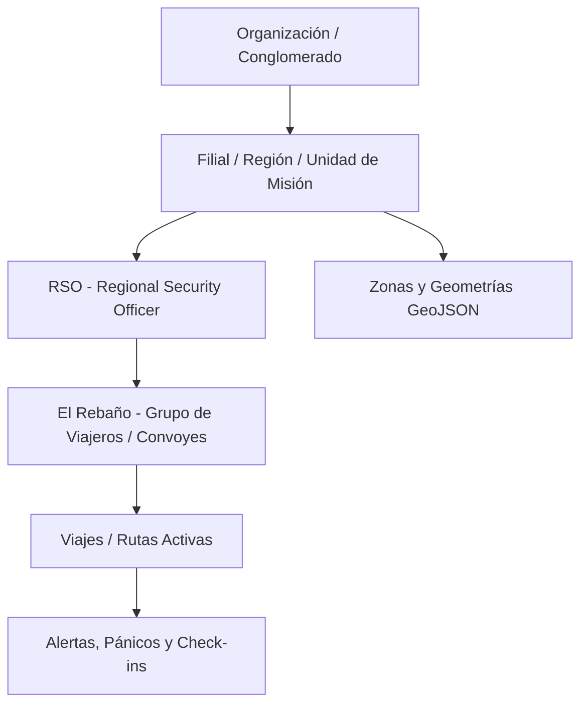

# MEMORIA TÉCNICA Y DE ARQUITECTURA — GZN (GREEN ZONE NETWORK)

> **PROYECTO SECURE ROUTE · SISTEMA DE PROTECCIÓN Y MOVILIDAD TÁCTICA**  
> *Documento de Memoria Viva, Gobernanza de Datos y Registro de Decisiones de Arquitectura (ADR)*  
> **Última actualización:** 2026-09-13 | **Versión:** 1.0 (Arranque de Backend)

---

## 1. Ficha Técnica y Ecosistema de Servicios

| Servicio | Identificador / URL | Función en GZN |
| :--- | :--- | :--- |
| **Repositorio Central** | [`https://github.com/Isskion/GZN`](https://github.com/Isskion/GZN) | Código fuente unificado (Backend, Web RSO, Scripts de infraestructura). |
| **Base de Datos & Geo** | **Supabase** (`hyhfdzribmathwridokg`)<br>API: `https://hyhfdzribmathwridokg.supabase.co` | **Fuente de la Verdad:** PostgreSQL + PostGIS nativo, RLS multi-tenant, Auth/SSO y Realtime WebSockets para el mapa en vivo. |
| **Alertas & Push** | **Firebase / Firestore** (`greenzonenavigator`) | **Canal de Emergencia:** Firebase Cloud Messaging (FCM) para push prioritarias accionables y telemetría efímera de alta frecuencia. |
| **Alojamiento & Edge** | **Vercel** | Despliegue de la Consola Web RSO (Next.js App Router + MapLibre GL) y Serverless API Endpoints. |
| **Cartografía Base** | MapLibre GL + MapTiler / PMTiles | Capas vectoriales base sin telemetría de terceros ni fuga de privacidad. |

---

## 2. Propósito y Filosofía de Misión Crítica

GZN no es una aplicación convencional de navegación o mensajería; es un sistema de **salvaguarda de la integridad física y cumplimiento legal de *Duty of Care*** para personal corporativo, diplomático y convoyes en zonas de conflicto y alto riesgo (LATAM, África Occidental, Oriente Medio).

### Principios Fundamentales:
1. **La Red Fallará (Diseño Blackout):** Asumir que el 4G y las comunicaciones terrestres serán inhibidas o destruidas en el momento crítico. El sistema debe operar con geofencing local y canal de emergencia de bajo ancho de banda (SMS binario / satelital).
2. **Soberanía y Privacidad de Datos:** La telemetría de directivos y expatriados no puede pasar por intermediarios de rastreo publicitario (Google Maps / Apple MapKit).
3. **Escalada Antipánico y Fatiga de Alertas:** Los cortes de señal por sombra orográfica no son automáticamente un secuestro; la verificación escala progresivamente antes de movilizar al GSOC (Global Security Operations Center).
4. **Camuflaje OpSec Real:** Ante una inspección forzada en un retén armado, la app no debe parecer militar ni de seguridad; cuenta con interfaz neutra ("Field Notes") y PIN de coacción (*Duress PIN*).

---

## 3. Arquitectura del Backend y Flujos Operativos

### 3.1. Modelo Jerárquico Multi-tenant (Tenancy)


*   **Organización:** Cliente matriz (Conglomerado multinacional).
*   **Filial / Región:** Subdivisión geográfica o societaria (ej. *África Occidental*, *Colombia Operaciones*).
*   **RSO (Regional Security Officer):** Usuario gestor con acceso a su consola operativa, definición de áreas y mando sobre el "rebaño".
*   **Viajeros / Rebaño:** Usuarios sobre el terreno (expatriados, conductores, técnicos) vinculados a uno o varios RSOs.

---

### 3.2. Catálogo y Clasificación de Zonas (Geofencing)

Las zonas se almacenan en Supabase utilizando geometrías espaciales PostGIS (`geometry(Polygon, 4326)` o `MultiPolygon`):

| Tipo de Zona | Severidad | Comportamiento en Ruteo | Acción al Entrar / Violar |
| :--- | :--- | :--- | :--- |
| **Zona Roja (`RED`)** | Conflicto Activo / Peligro Letal | **Bloqueante.** Prohibido transitar salvo escape. | Alerta inmediata al RSO y vibración persistente al móvil. |
| **Zona Ámbar (`AMBER`)** | Riesgo Medio / Toque de Queda | Penalizada (solo si no hay alternativa viable). | Aviso informativo al viajero y aumento de telemetría a 1 Hz. |
| **Safe Haven (`SAFE_HAVEN`)** | Refugio, Embajada, Base Segura | Prioritaria en replanificación de escape. | Marca de seguridad, parada de emergencia y check-in automático. |
| **Corredor Seguro (`CORRIDOR`)** | Ruta previamente autorizada | Preferente. | Monitoreo de abandono de ruta. |

---

### 3.3. Gestión de Briefings con POIs Compartidos

El RSO prepara un desplazamiento generando un **Briefing de Misión**:
1. El RSO abre el mapa, dibuja los puntos de interés (POIs: punto de encuentro, hospital concertado, refugio, zonas vedadas).
2. Asigna el briefing a uno o varios miembros del "rebaño" o al convoy completo.
3. El móvil descarga los POIs y las zonas de forma local para visualizarlos sin necesidad de conexión.
4. Al cruzar el viajero el perímetro del país o región, recibe un **Mensaje de Bienvenida Táctico** con los números de emergencia del RSO local y las pautas activas de seguridad.

---

### 3.4. Protocolo de "Hombre Muerto" (Dead Man's Switch)

Si un viajero entra en una zona de riesgo o ruta crítica y el backend deja de recibir telemetría:
1. **Fase 1 (Aviso Local - 60 seg):** La app vibra y solicita confirmación con PIN o botón ("Confirme su estado").
2. **Fase 2 (Ping por Canal Secundario):** Intento de comprobación vía SMS binario o enlace alternativo.
3. **Fase 3 (Ventana Dinámica por Vector de Salida):** Si la última velocidad y rumbo indicaban que el convoy ya salía de la zona, se concede una ventana de gracia para evitar falsas alarmas por sombra orográfica.
4. **Fase 4 (Escalada a Crisis GSOC):** Si no hay respuesta tras la ventana de gracia, se dispara alerta roja al RSO con la última posición conocida, nivel de batería y vector de desplazamiento.

---

## 4. Esquema de Base de Datos DDL (PostgreSQL + PostGIS)

Este esquema se despliega en el proyecto Supabase `hyhfdzribmathwridokg`. Incluye soporte geoespacial nativo, índices espaciales R-Tree (`GIST`) y funciones RPC de cálculo ultra-rápido de violaciones de perímetro.

```sql
-- ============================================================================
-- GZN POSTGIS SCHEMA v1.0 — PROYECTO SECURE ROUTE
-- ============================================================================

-- 1. Habilitar extensión geoespacial
CREATE EXTENSION IF NOT EXISTS postgis;
CREATE EXTENSION IF NOT EXISTS "uuid-ossp";

-- 2. Organizaciones (Multi-tenancy)
CREATE TABLE IF NOT EXISTS public.organizations (
    id UUID PRIMARY KEY DEFAULT uuid_generate_v4(),
    name TEXT NOT NULL,
    cif_tax_id TEXT,
    created_at TIMESTAMPTZ DEFAULT NOW(),
    updated_at TIMESTAMPTZ DEFAULT NOW()
);

-- 3. Perfiles de Usuario (RSOs, Operadores de Seguridad, Administradores)
CREATE TABLE IF NOT EXISTS public.profiles (
    id UUID PRIMARY KEY REFERENCES auth.users(id) ON DELETE CASCADE,
    organization_id UUID NOT NULL REFERENCES public.organizations(id),
    full_name TEXT NOT NULL,
    role TEXT NOT NULL CHECK (role IN ('SUPER_ADMIN', 'ORG_ADMIN', 'RSO', 'OPERATOR')),
    phone TEXT,
    emergency_contact TEXT,
    is_active BOOLEAN DEFAULT TRUE,
    created_at TIMESTAMPTZ DEFAULT NOW(),
    updated_at TIMESTAMPTZ DEFAULT NOW()
);

-- 4. El Rebaño: Viajeros, Expatriados y Conductores asignados
CREATE TABLE IF NOT EXISTS public.travelers (
    id UUID PRIMARY KEY DEFAULT uuid_generate_v4(),
    organization_id UUID NOT NULL REFERENCES public.organizations(id),
    assigned_rso_id UUID REFERENCES public.profiles(id),
    full_name TEXT NOT NULL,
    email TEXT,
    phone TEXT NOT NULL,
    callsign TEXT, -- Indicativo de radio o convoy
    status TEXT NOT NULL DEFAULT 'SAFE' CHECK (status IN ('SAFE', 'WARNING', 'DANGER', 'PANIC', 'INCOMMUNICADO')),
    last_latitude DOUBLE PRECISION,
    last_longitude DOUBLE PRECISION,
    last_ping_at TIMESTAMPTZ,
    battery_level INT,
    device_secret_hash TEXT, -- Hash SHA-256 de secreto de hardware (escalón intermedio hacia ECDSA P-256)
    created_at TIMESTAMPTZ DEFAULT NOW(),
    updated_at TIMESTAMPTZ DEFAULT NOW()
);

-- 5. Catálogo de Zonas de Riesgo y Refugios (GeoJSON / PostGIS)
CREATE TABLE IF NOT EXISTS public.zones (
    id UUID PRIMARY KEY DEFAULT uuid_generate_v4(),
    organization_id UUID NOT NULL REFERENCES public.organizations(id),
    created_by UUID REFERENCES public.profiles(id),
    name TEXT NOT NULL,
    description TEXT,
    severity TEXT NOT NULL CHECK (severity IN ('RED', 'AMBER', 'SAFE_HAVEN', 'CORRIDOR')),
    color_hex TEXT DEFAULT '#EF4444',
    geom GEOMETRY(Polygon, 4326) NOT NULL,
    valid_from TIMESTAMPTZ DEFAULT NOW(),
    valid_until TIMESTAMPTZ,
    is_active BOOLEAN DEFAULT TRUE,
    created_at TIMESTAMPTZ DEFAULT NOW(),
    updated_at TIMESTAMPTZ DEFAULT NOW()
);

-- Índice espacial para consultas en milisegundos
CREATE INDEX IF NOT EXISTS idx_zones_geom ON public.zones USING GIST (geom);
CREATE INDEX IF NOT EXISTS idx_zones_org_active ON public.zones(organization_id, is_active);

-- 6. Briefings y Puntos de Interés (POIs)
CREATE TABLE IF NOT EXISTS public.briefings (
    id UUID PRIMARY KEY DEFAULT uuid_generate_v4(),
    organization_id UUID NOT NULL REFERENCES public.organizations(id),
    author_rso_id UUID NOT NULL REFERENCES public.profiles(id),
    title TEXT NOT NULL,
    welcome_message TEXT,
    protocol_instructions TEXT,
    created_at TIMESTAMPTZ DEFAULT NOW(),
    updated_at TIMESTAMPTZ DEFAULT NOW()
);

CREATE TABLE IF NOT EXISTS public.briefing_pois (
    id UUID PRIMARY KEY DEFAULT uuid_generate_v4(),
    briefing_id UUID NOT NULL REFERENCES public.briefings(id) ON DELETE CASCADE,
    name TEXT NOT NULL,
    category TEXT NOT NULL CHECK (category IN ('EXTRACTION_POINT', 'HOSPITAL', 'POLICE', 'SAFE_HOUSE', 'CHECKPOINT', 'DANGER_POINT')),
    latitude DOUBLE PRECISION NOT NULL,
    longitude DOUBLE PRECISION NOT NULL,
    notes TEXT
);

-- 7. Alertas de Seguridad y Eventos de Pánico
CREATE TABLE IF NOT EXISTS public.alerts (
    id UUID PRIMARY KEY DEFAULT uuid_generate_v4(),
    organization_id UUID NOT NULL REFERENCES public.organizations(id),
    traveler_id UUID NOT NULL REFERENCES public.travelers(id) ON DELETE CASCADE,
    zone_id UUID REFERENCES public.zones(id),
    alert_type TEXT NOT NULL CHECK (alert_type IN ('ZONE_VIOLATION', 'PANIC_BUTTON', 'DEAD_MAN_TRIGGER', 'DURESS_PIN', 'DEVIATION', 'MANUAL_SOS')),
    severity TEXT NOT NULL CHECK (severity IN ('LOW', 'MEDIUM', 'HIGH', 'CRITICAL')),
    latitude DOUBLE PRECISION NOT NULL,
    longitude DOUBLE PRECISION NOT NULL,
    memo TEXT,
    status TEXT NOT NULL DEFAULT 'OPEN' CHECK (status IN ('OPEN', 'ACKNOWLEDGED', 'INVESTIGATING', 'RESOLVED', 'FALSE_ALARM')),
    resolved_by UUID REFERENCES public.profiles(id),
    resolved_at TIMESTAMPTZ,
    created_at TIMESTAMPTZ DEFAULT NOW()
);

-- 8. Registro de Auditoría Inmutable (Legal & Duty of Care)
CREATE TABLE IF NOT EXISTS public.audit_logs (
    id UUID PRIMARY KEY DEFAULT uuid_generate_v4(),
    organization_id UUID NOT NULL REFERENCES public.organizations(id),
    performed_by UUID,
    action TEXT NOT NULL,
    entity_type TEXT NOT NULL,
    entity_id TEXT,
    payload JSONB,
    created_at TIMESTAMPTZ DEFAULT NOW()
);

-- ============================================================================
-- FUNCIONES RPC GEOESPACIALES
-- ============================================================================

-- Comprueba si una coordenada está dentro de alguna zona activa y devuelve la más restrictiva
CREATE OR REPLACE FUNCTION public.check_point_zones(
    p_org_id UUID,
    p_lat DOUBLE PRECISION,
    p_lon DOUBLE PRECISION
)
RETURNS TABLE (
    zone_id UUID,
    zone_name TEXT,
    severity TEXT,
    color_hex TEXT
)
LANGUAGE sql
STABLE
AS $$
    SELECT 
        z.id AS zone_id,
        z.name AS zone_name,
        z.severity,
        z.color_hex
    FROM public.zones z
    WHERE z.organization_id = p_org_id
      AND z.is_active = TRUE
      AND (z.valid_until IS NULL OR z.valid_until > NOW())
      AND ST_Contains(z.geom, ST_SetSRID(ST_Point(p_lon, p_lat), 4326))
    ORDER BY 
        CASE z.severity 
            WHEN 'RED' THEN 1 
            WHEN 'AMBER' THEN 2 
            WHEN 'SAFE_HAVEN' THEN 3 
            ELSE 4 
        END ASC;
$$;

-- Encuentra el Safe Haven más cercano a un punto dado
CREATE OR REPLACE FUNCTION public.find_nearest_safe_haven(
    p_org_id UUID,
    p_lat DOUBLE PRECISION,
    p_lon DOUBLE PRECISION
)
RETURNS TABLE (
    zone_id UUID,
    zone_name TEXT,
    distance_meters DOUBLE PRECISION
)
LANGUAGE sql
STABLE
AS $$
    SELECT 
        z.id AS zone_id,
        z.name AS zone_name,
        ST_Distance(
            z.geom::geography, 
            ST_SetSRID(ST_Point(p_lon, p_lat), 4326)::geography
        ) AS distance_meters
    FROM public.zones z
    WHERE z.organization_id = p_org_id
      AND z.severity = 'SAFE_HAVEN'
      AND z.is_active = TRUE
    ORDER BY distance_meters ASC
    LIMIT 1;
$$;

-- Creación segura de zona con geometría GeoJSON y PostGIS ST_GeomFromGeoJSON
CREATE OR REPLACE FUNCTION public.create_zone_with_geojson(
    p_org_id UUID DEFAULT NULL,
    p_name TEXT DEFAULT NULL,
    p_description TEXT DEFAULT NULL,
    p_severity TEXT DEFAULT NULL,
    p_color_hex TEXT DEFAULT NULL,
    p_geojson TEXT DEFAULT NULL,
    p_valid_until TIMESTAMPTZ DEFAULT NULL
)
RETURNS public.zones
LANGUAGE plpgsql
SECURITY DEFINER
SET search_path = public, extensions
AS $$
... (ver sql/003_zone_creation_rpc.sql para implementación completa)
$$;
```

---

## 5. Colecciones Firestore (Telemetría de Alta Frecuencia y Broadcasts)

Para no saturar la base de datos relacional de Supabase con pings cada segundo, Firebase Firestore almacena la telemetría en tránsito:

1. **`active_telemetry/{travelerId}`**:
   *   `current_lat`: double
   *   `current_lon`: double
   *   `speed_kmh`: double
   *   `heading_degrees`: double
   *   `battery_percent`: int
   *   `updated_at`: timestamp
2. **`broadcast_alerts/{alertId}`**:
   *   `organization_id`: string
   *   `target_group`: "ALL" | list of travelerIds
   *   `title`: string (ej. *"ALERTA DE SEGURIDAD: Evacuar hacia Base Alfa"*)
   *   `body`: string
   *   `requires_ack`: boolean (botón de confirmación OK)
   *   `sent_at`: timestamp
3. **`sos_channel/{alertId}`**:
   *   Canal de telemetría de emergencia y pánicos activos.

---

## 6. Sistema de Hooks y Cumplimiento de la Memoria

Para garantizar que **NADA** se desarrolle al margen de esta memoria, se han configurado dos barreras automáticas:

1. **Lifecycle Hook de Antigravity (`.agents/hooks.json`):**
   *   Intercepta cada invocación (`PreInvocation`) e inyecta la regla fundamental de actualización documental mediante `./scripts/memory-hook.sh`.
2. **Git Pre-Commit Hook (`.githooks/pre-commit`):**
   *   Comprueba la integridad y presencia de `MEMORIA.md` antes de permitir cualquier commit en el repositorio.
3. **Reglamento Operativo (`AGENTS.md` y `GEMINI.md`):**
   *   Contrato de pair-programming explícito: ningún cambio de código, tabla SQL o endpoint se considera finalizado sin registrarse en esta memoria.

---

## 7. Registro de Decisiones de Arquitectura (ADR)

*   **ADR-001 (2026-09-13): Adopción de Arquitectura Híbrida Supabase + Firestore.**  
    *Decisión:* Supabase (PostgreSQL + PostGIS) almacena la estructura transaccional, geométrica y de auditoría inmutable. Firestore y FCM gestionan la entrega instantánea de notificaciones push prioritarias y la telemetría de alta frecuencia.
*   **ADR-002 (2026-09-13): Ruteo Dual Online/Offline.**  
    *Decisión:* El ruteo no puede depender exclusivamente de APIs cloud. La app móvil incluirá un motor embebido (GraphHopper/Valhalla) con el grafo vial y zonas precargadas para navegación sin red.
*   **ADR-003 (2026-09-13): Descarte del Modo Oculto Puro / Adopción de Silent Duress.**  
    *Decisión:* No se violan las políticas de Google Play / Apple Store. Se implementa interfaz señuelo ("Field Notes") y Duress PIN para protección en inspección física.
*   **ADR-004 (2026-09-13): Row Level Security (RLS) Estricto con Funciones SECURITY DEFINER.**  
    *Decisión:* RLS activo en el 100% de las tablas. Se implementan funciones auxiliares `get_auth_org_id()` y `get_auth_role()` con `SECURITY DEFINER` para evaluar pertenencia a organización y rol sin incurrir en recursión infinita en PostgreSQL. Se garantiza inmutabilidad absoluta de `audit_logs` (sin UPDATE ni DELETE).
*   **ADR-005 (2026-09-13): Next.js 15 App Router + MapLibre GL para Consola RSO y Edge APIs.**  
    *Decisión:* La consola de mando del RSO se implementa con Next.js 15 (App Router), Tailwind CSS y MapLibre GL para visualización cartográfica táctica y soporte de capas GeoJSON vectoriales sin depender de SDKs cerrados. Las rutas API (`/api/zones`, `/api/telemetry`, `/api/alerts`) orquestan la evaluación espacial en PostGIS y el despacho de notificaciones de emergencia con Firebase Admin SDK (FCM).
*   **ADR-006 (2026-09-14): Autenticación Dual RSO/Dispositivo, Tenancy Estricto y RPC PostGIS GeoJSON.**  
    *Decisión:* Resolución de los Bloqueantes 1 y 2 de la auditoría:
    1. **Autenticación Consola RSO:** `/api/zones` (GET/POST) y `/api/alerts` (GET) sustituyen el cliente `createAdminClient` por el cliente de sesión `createClient` respetando RLS. Se elimina el parámetro `organization_id` del query/body; la pertenencia se deriva estrictamente de `public.get_auth_org_id()` vía Postgres.
    2. **Autenticación Terminal Móvil (Escalón Intermedio):** `/api/telemetry` y `/api/alerts` (SOS móvil) exigen la cabecera `x-device-secret`, validada contra `travelers.device_secret_hash` (SHA-256 en tiempo constante). Se documenta expresamente como paso intermedio previo al binding criptográfico asimétrico ECDSA P-256 definitivo (Hoja de Ruta Subsistema 1). Ningún endpoint en `src/app/api/` usa `createAdminClient` directamente.
    3. **Creación de Zonas e Integridad Geoespacial:** Despliegue de `sql/003_zone_creation_rpc.sql` con la función RPC `create_zone_with_geojson` (usa `ST_GeomFromGeoJSON`, `ST_SetSRID` en 4326 y `ST_IsValid`). Se elimina el fallback de inserción directa silenciosa en el route handler y se implementa validador estricto en servidor (`validateGeoJSONPolygon`) para devolver 400 controlado ante geometrías malformadas o anillos no cerrados. Se añade control estricto de roles en la RPC (`public.get_auth_role() IN ('RSO', 'ORG_ADMIN', 'SUPER_ADMIN')`) para impedir que operadores (`OPERATOR`) escalen privilegios creando zonas dentro del mismo tenant (error HTTP 403).  
    *Nota de Gobernanza y Auditoría (2026-09-14):* La validación inicial con ramas mock de desarrollo en `session.ts` fue rechazada formalmente por la auditoría por no ser representativa del sistema real y suponer un patrón inseguro. Se eliminó cualquier mecanismo de bypass o sesión simulada en `src/lib/auth/session.ts`. Toda validación descansa exclusivamente en `public.get_auth_role()` en PostgreSQL y `supabase.auth.getUser()` real.

---

## 8. Estado de Implementación y Próximos Sprints

1. [x] **Base de Datos & Seguridad en Supabase:** Esquema PostGIS desplegado y **Row Level Security (RLS) activo** con políticas multi-tenant (`sql/001_initial_schema_postgis.sql` y `sql/002_rls_security_policies.sql`) en `hyhfdzribmathwridokg`.
2. [x] **Consola RSO & Core Backend en Next.js:** Estructura completa inicializada en `/home/daniel/GZN` con TypeScript, Tailwind CSS táctico y visor cartográfico MapLibre GL (`src/app/page.tsx`). Compilación verificada con `pnpm build` (exit code 0).
3. [x] **Resolución Bloqueante 1 (Auditoría 2026-09-14):**
   *   Autenticación de sesión en `/api/zones` (GET/POST) y `/api/alerts` (GET).
   *   Autenticación de hardware pre-compartido (`x-device-secret` + `device_secret_hash` SHA-256) en `/api/telemetry` y `/api/alerts` (SOS).
   *   Eliminación de `createAdminClient()` en todas las rutas de `src/app/api/`.
   *   Multi-tenancy forzado por RLS (`get_auth_org_id()`), prohibiendo inyección de `organization_id` por cliente.
4. [x] **Resolución Bloqueante 2 (Auditoría 2026-09-14):**
   *   Script `sql/003_zone_creation_rpc.sql` con la RPC `create_zone_with_geojson` y `get_active_zones`.
   *   Validador TypeScript `validateGeoJSONPolygon` en `src/lib/geo/validation.ts` (retorna 400 descriptivo ante polígonos no cerrados o vértices inválidos).
   *   Eliminación del fallback silencioso en `POST /api/zones`.
5. [ ] **Próximo Hito — Revisión de Claude & Despliegue en Vercel:**
   *   Superar checklist de auditoría de Claude en `intercambio/desde-claude/`.
   *   Vincular variables de entorno en Vercel y repositorio GitHub tras visto bueno explícito.
   *   Módulo interactivo de dibujo de polígonos (MapLibre Draw) directamente desde la consola RSO.

